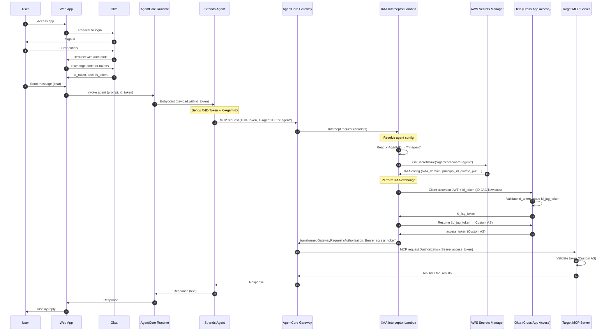

# Sequence Diagram: Agent → MCP via AgentCore Gateway + XAA Interceptor Lambda

Agent reaches the MCP server **through** an AgentCore Gateway. The Gateway does not forward the client `Authorization` header; a **XAA Interceptor Lambda** reads the token from `X-ID-Token`, identifies the agent via `X-Agent-ID`, fetches XAA credentials from **AWS Secrets Manager**, performs the **Okta Cross-App Access (ID-JAG)** exchange inside the Lambda, and returns `Authorization: Bearer <custom-AS-access-token>` so the Gateway forwards a properly-scoped token to the MCP target.

Unlike the [Gateway + Okta MCP Adapter pattern](02-sequence-gateway-interceptor.md) (where XAA happens in an external adapter), here the **Lambda itself performs the XAA exchange** — no adapter is needed.

## Key Differences from Other Patterns

| Aspect | Direct XAA (Pattern 1) | Gateway + Adapter (Pattern 2) | Gateway + XAA Interceptor (Pattern 3) |
|--------|------------------------|-------------------------------|---------------------------------------|
| **Where XAA happens** | Inside the agent | In the Okta MCP Adapter (proxy) | In the Lambda interceptor |
| **Multi-agent** | No (per-agent config) | Adapter handles all agents | Yes (`X-Agent-ID` + Secrets Manager) |
| **Agent complexity** | Agent runs XAA SDK | Agent only passes id_token | Agent only passes id_token + agent ID |
| **Extra infrastructure** | None | Okta MCP Adapter (separate service) | Lambda + Secrets Manager |
| **Token on MCP target** | Custom AS access_token | Custom AS access_token | Custom AS access_token |
