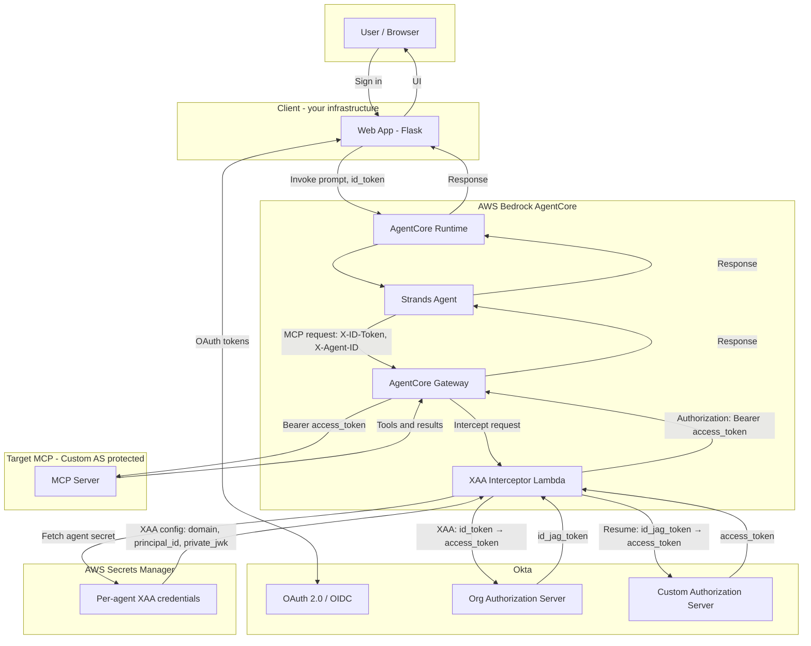
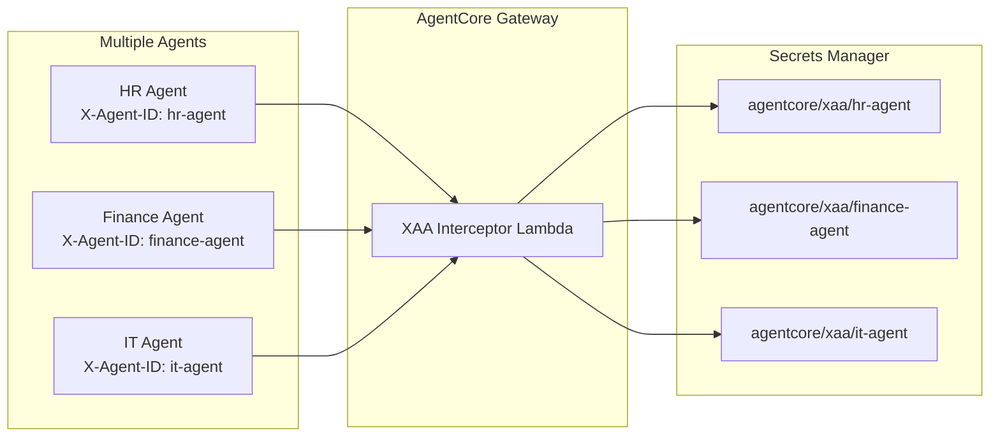

# Architecture: Agent → MCP via AgentCore Gateway + XAA Interceptor Lambda

The agent connects to the MCP server **through** an AgentCore Gateway. A **XAA Interceptor Lambda** performs the Okta Cross-App Access (ID-JAG) token exchange inside the Gateway's request pipeline — no external adapter needed. The Lambda identifies the calling agent via `X-Agent-ID`, fetches per-agent XAA credentials from **AWS Secrets Manager**, and exchanges the user's `id_token` for a properly-scoped **custom authorization server access_token** before the request reaches the MCP target.

## Components

| Component | Role |
|-----------|------|
| **Web App** | Okta OAuth login; sends user message and `id_token` to AgentCore. |
| **AgentCore Runtime** | Hosts the Strands agent; passes payload including `id_token` to the agent entrypoint. |
| **Strands Agent** | Sends MCP requests to **Gateway** with `X-ID-Token` and `X-Agent-ID` headers. Does **not** perform XAA itself. |
| **AgentCore Gateway** | Proxies MCP traffic to the target; does not forward client `Authorization`; invokes the XAA interceptor Lambda. |
| **XAA Interceptor Lambda** | Reads `X-Agent-ID`; fetches credentials from Secrets Manager; performs XAA (ID-JAG) exchange; returns `Authorization: Bearer <access_token>`. Caches secrets in-memory for warm invocations. |
| **AWS Secrets Manager** | Stores per-agent XAA config: `okta_domain`, `principal_id`, `authorization_server_id`, `scope`, `private_jwk`. One secret per agent: `agentcore/xaa/<agent-id>`. |
| **Okta Token Exchange** | Org AS: client assertion + id_token → ID-JAG token. Custom AS: ID-JAG → scoped access_token. |
| **Target MCP Server** | Protected by Okta Custom Authorization Server; validates the access token. |

## Multi-Agent Support

Each agent identifies itself via `X-Agent-ID`. The Lambda fetches the corresponding secret, which contains the Okta credentials specific to that agent (different service apps, scopes, or even different Okta orgs). No Lambda redeployment is needed when adding a new agent — just create a new secret in Secrets Manager.
